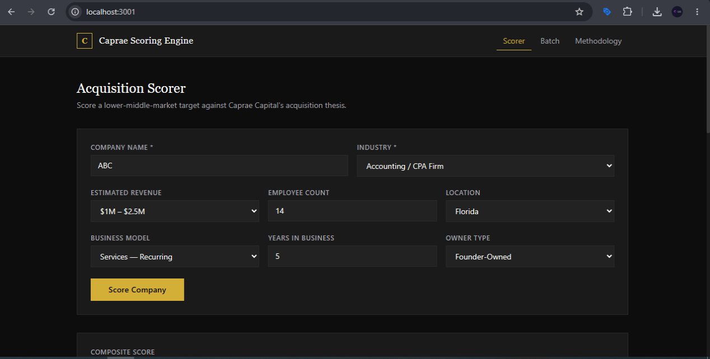
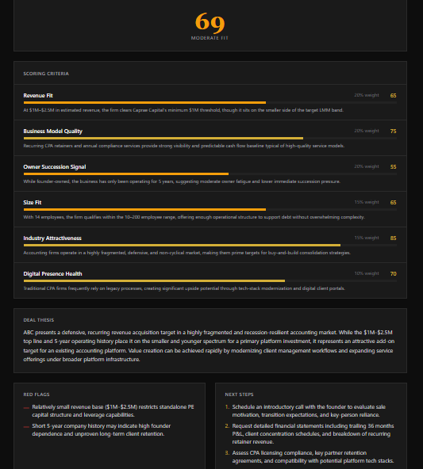
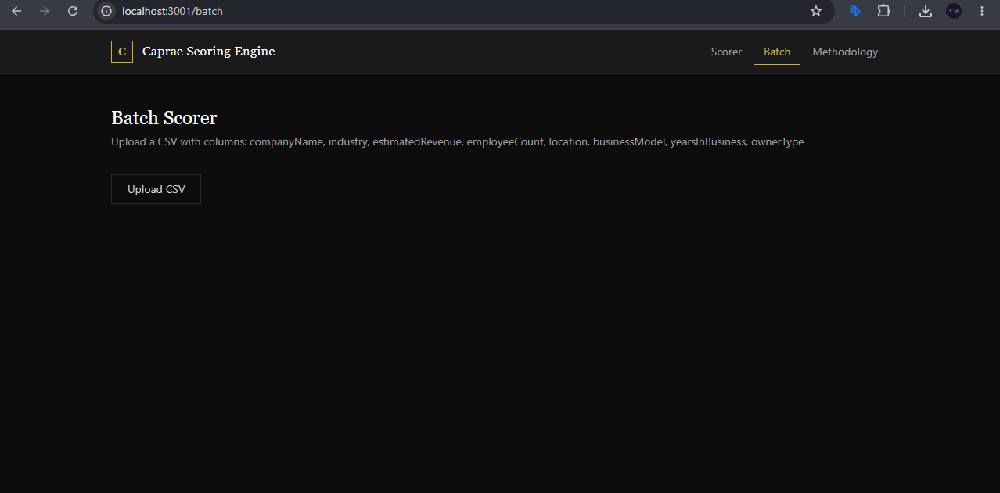

# Caprae M&A Acquisition Scoring Engine

## Description

The Caprae M&A Acquisition Scoring Engine is a web-based analyst tool built to accelerate lower-middle-market acquisition workflows for Caprae Capital. Given a set of company inputs — industry, revenue, employee count, business model, owner type, and location — the engine produces a structured acquisition score across six weighted criteria, a deal thesis narrative, flagged risks, and prioritised next steps. It was built as a SaaSquatch enhancement layer: where SaaSquatch surfaces leads, this tool scores them, allowing an analyst or ETA operator to move from raw lead data to a qualified acquisition signal in under 60 seconds.

---

## Live Demo

[Live Demo](https://caprae-scoring-engine.vercel.app/)

---

## Features

- **Single company scorer** — Fill out a form and receive a full AI-generated acquisition score instantly
- **Batch scoring** — Upload a CSV of up to 20 companies and score them sequentially with one click
- **Per-criterion breakdown** — Six scored criteria with individual score bars and rationale text
- **Deal thesis** — A 3–5 sentence narrative on acquisition fit specific to each company
- **Red flags & next steps** — Surfaced risks and prioritised follow-up actions per target
- **Clickable row detail modal** — In the batch view, each scored row opens a full slide-in panel with the complete breakdown
- **Flexible CSV import** — Accepts multiple column name formats including camelCase, snake_case, and display labels

---

## Screenshots

### Single Company Scorer — Input Form


### Single Company Scorer — Score Card


### Batch Scorer


---

## Tech Stack

| Layer | Technology |
|---|---|
| Framework | Next.js 14 (App Router) |
| Language | TypeScript |
| Styling | Tailwind CSS |
| AI Scoring Engine | Google Gemini 2.0 Flash (via REST API) |
| CSV Parsing | PapaParse |
| Hosting | Vercel (serverless) |

---

## Architecture Decisions

**Stateless design (no database)**
All scoring state lives in the browser for the duration of a session. There is no persistence layer, no user accounts, and no stored results. This was intentional: the analyst workflow is run-and-export, not persistent. Adding a database would introduce auth, schema management, and cost overhead with no workflow benefit in the current scope.

**Gemini as scoring engine**
The scoring logic is delivered entirely via a structured prompt to the Gemini 2.0 Flash API. The architecture is fully model-agnostic — the API route accepts any model behind the same JSON contract. In a production deployment, Claude Sonnet would be the preferred model for its stronger instruction-following and more consistent structured output. Gemini 2.0 Flash is used here due to free-tier availability during development.

**Vercel serverless hosting**
The `/api/score` route runs as a Vercel serverless function. This means zero infrastructure management, automatic scaling, and no idle cost — appropriate for a low-frequency analyst tool.

**No caching layer**
Each score request is intentionally stateless and uncached. Acquisition scoring involves nuanced judgment where re-running the same company with updated inputs should always produce a fresh result. A caching layer would risk serving stale scores and adds unnecessary complexity.

---

## Scoring Methodology

The composite score is a weighted average of six criteria, each scored 0–100.

| Criterion | Weight | Signal |
|---|---|---|
| Revenue Fit | 20% | Sweet spot is $1M–$20M ARR. Below $500K = too small; above $50M = outside LMM thesis. |
| Business Model Quality | 20% | Recurring revenue scores highest (SaaS, services-recurring). Project-based scores lowest. |
| Owner Succession Signal | 20% | Founder-owned 10+ years signals peak exit motivation. PE-backed scores lowest. |
| Size Fit | 15% | Ideal band is 10–200 employees. Outside this range reduces score linearly. |
| Industry Attractiveness | 15% | Favours fragmented, defensive, non-cyclical industries. Penalises commoditised or declining sectors. |
| Digital Presence Health | 10% | Outdated digital presence = value-creation opportunity. Already-modern businesses have less upside. |

---

## Setup Instructions

```bash
# 1. Clone the repository
git clone https://github.com/mantiqdata-demo/caprae-scoring-engine.git
cd caprae-scoring-engine

# 2. Install dependencies
npm install

# 3. Create your environment file
cp .env.example .env.local
# Add your Gemini API key to .env.local

# 4. Start the development server
npm run dev
```

Open [http://localhost:3000](http://localhost:3000) in your browser.

---

## Sample Data

A sample CSV file is included for testing the batch scorer:

```bash
samples/test-batch.csv
```

Upload this file on the Batch Scoring page to see the engine score 10 real lower-middle-market acquisition targets across HVAC, dental, landscaping, plumbing, travel, pest control, IT services, roofing, accounting, and staffing industries.

---

## Environment Variables

Create a `.env.local` file in the project root:

```
GEMINI_API_KEY=your_key_here
```

Get a free API key at [https://aistudio.google.com](https://aistudio.google.com).

---

## Project Structure

```
caprae-scoring-engine/
├── src/
│   ├── app/
│   │   ├── api/
│   │   │   └── score/
│   │   │       └── route.ts        # Gemini API integration + scoring prompt
│   │   ├── batch/
│   │   │   └── page.tsx            # Batch CSV scorer with detail panel
│   │   ├── about/
│   │   │   └── page.tsx            # Scoring methodology reference page
│   │   ├── layout.tsx              # Root layout with navigation
│   │   ├── page.tsx                # Single company scorer
│   │   └── globals.css             # Global styles and Tailwind base
│   ├── components/
│   │   ├── CompanyForm.tsx         # Scorer input form with dropdowns
│   │   └── Navigation.tsx          # Top nav bar
│   └── types/
│       └── index.ts                # Shared TypeScript types
├── .env.example                    # Environment variable template
├── .env.local                      # Local secrets (git-ignored)
├── tailwind.config.ts              # Design tokens (colors, fonts)
└── vercel.json                     # Vercel deployment config
```

---

## Submission Context

This project was built as part of the Caprae Capital Full Stack Developer interview process under a 5-hour build constraint. The goal was to design a tool that enhances the SaaSquatch lead generation workflow by adding an acquisition-focused scoring layer — turning raw company data into a structured, analyst-ready signal. The scoring rubric, weighting, and deal thesis logic were designed to reflect Caprae Capital's stated lower-middle-market thesis, with a focus on founder-owned, recurring-revenue businesses in fragmented industries.
